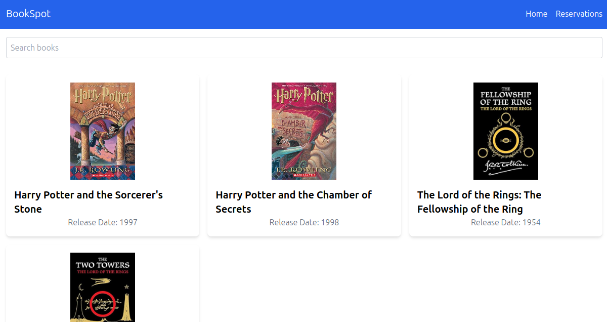
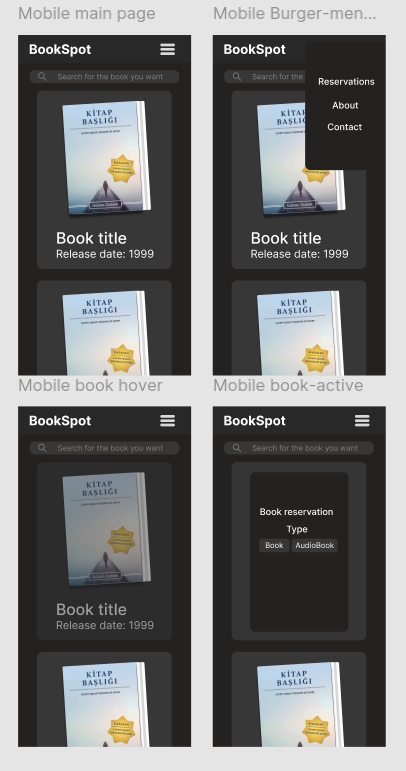

<!-- PROJECT LOGO -->

<h3 align="center"> BookStop </h3>

  

    Book Library | Full-stack | Responsive
     
     
    <a href="https://bookspot-webapp.netlify.app/">View Demo</a>
    ·
    <a href="https://github.com/shpokas-io/bookstop-webapp/issues">Report Bug</a>
    ·
    <a href="https://github.com/shpokas-io/bookstop-webapp/issues">Request Feature</a>
  

<!-- TABLE OF CONTENTS -->

  
Table of Contents

  <ol>
    <li>
      <a href="#about-the-project">About The Project</a>
      <ul>
        <li><a href="#built-with">Built With</a></li>
      </ul>
    </li>
    <li>
      <a href="#installation">Installation</a>
    </li>
    </li>
    <li><a href="#contact">Contact</a></li>
    <li>
      <a href="#left-to-do">Left To Do</a>
    </li>
    <li>
      <a href="#tought-process">Tought Process</a>
    </li>
  </ol>

<!-- ABOUT THE PROJECT -->

## About The Project

BookStop is a full-stack application that provides users with a seamless experience for managing and discovering books. The project is built using ASP.NET Core for the backend and React with Vite for the frontend.

- Add, edit, delete, and view books.
- Easily find books using search filters.
- Mobile-friendly interface for an optimal user experience.
- Calculations coming from the backend API.

 

(<a href="#readme-top">back to top</a>)

### Built With

##### Back end

- ![ASP.NET Core][ASP.NET Core]
- ![Entity Framework Core][Entity Framework Core]

##### Front end

- ![React][React]
- ![Tailwind CSS][Tailwind CSS]
- ![Vite]
- ![NPM][NPM]

(<a href="#readme-top">back to top</a>)

### Installation

##### Backend Setup

- Clone this repo: 
  `git clone https://github.com/shpokas-io/bookstop-webapp`
- Navigate to backend directory: 
  `cd bookstopAPI`
- Restore dependencys: 
  `dotnet restore`
- Build and run the application: 
  `dotnet run`

##### Frontend setup

- Navigate to frontend directory: 
  `cd frontend`
- Install dependencys: 
  `npm install`
- Run development server: 
  `npm run dev`

#### Tought Process

This section contains the main problems I faced and were the hardest to debug. Maybe it will be useful for someone; otherwise, feel free to skip this section 😄

##### Design:

The process for app design was pretty straightforward. I sketched a simple layout of the page in my notebook, then transferred it to Figma and built the app based on the Figma design.
[text](https://www.figma.com/design/oqPbjto9dvjxVPzBOrAHRw/BookSpot-sketches?node-id=0-1&node-type=canvas&t=6Nf3ywBf66ehdanJ-0)

##### Key Problems Faced:

1. CORS Policy Errors: One of the biggest challenges I faced was getting the frontend (hosted on Netlify) to communicate with the backend (hosted on Heroku). CORS issues popped up when trying to fetch data from the API, with the error stating: "No 'Access-Control-Allow-Origin' header is present," blocking cross-origin requests.

2. Deployment and Routing Issues: I ran into problems with the second page not loading properly after deploying the frontend to Netlify. A 404 error appeared when trying to access pages like /reservations, which pointed to routing issues with direct access to non-root paths.

3. Inconsistent API Response: Along with CORS issues, I experienced moments when the API failed to fetch data from the backend, showing errors like net::ERR_FAILED. This indicated something was off with either the Heroku deployment or the API requests from the frontend.

4. Middleware and Pipeline Misconfiguration: I had to ensure that the middleware (like CORS policy) was correctly ordered in the backend codebase. For example, the CORS middleware needed to be applied before others like Authorization or HttpsRedirection to process requests correctly.

5. A lot more that i gladly would talk about

##### Key Features of the Bookspot Project:

1. Backend Using ASP.NET Core with In-Memory Database: The backend API is built with ASP.NET Core and Entity Framework, using an in-memory database to simulate a book database for development. This approach provides data without needing a persistent database. I also added a seeding mechanism to automatically populate it with initial books like Harry Potter and The Lord of the Rings.

2. Book Management API: The backend offers a REST API for book-related data, such as title, year, and cover image. The endpoints enable the frontend to fetch and display book data dynamically for the user.

3. Dynamic Routing and API Fetching: I integrated features to fetch book information dynamically from the API. When users interact with the frontend, it sends a request to retrieve the list of available books, displaying details like title, year, type (book or audiobook), and image.

4. CORS Setup for Frontend Integration: I defined a CORS policy to allow the frontend (hosted on Netlify) to communicate with the backend API. This setup ensures both environments can exchange data smoothly, enabling operations like fetching book data and sending requests without cross-origin issues.

5. Scalability Potential: While the current database is in-memory, the structure allows for an easy switch to a persistent database like SQL Server or PostgreSQL in the future. This means the app can scale beyond development and adapt to real, long-term data storage.
<!-- CONTACT -->

##### Steps Taken to Solve Problems:

1. Adjusting CORS Policy: I tackled CORS errors by setting up a policy in the backend to allow requests from https://bookspot-webapp.netlify.app. Including the AllowAnyHeader and AllowAnyMethod methods in the CORS configuration ensured that all request types from the frontend were permitted.

2. Reordering Middleware in the Backend: One key solution was reordering the middleware in the backend API. I made sure the CORS policy was applied early in the pipeline, before other middlewares like Authorization and HttpsRedirection, to prevent blocking requests.

3. Fixing Frontend Routes in Netlify: To resolve 404 errors when loading pages directly, I configured Netlify to support React’s client-side routing, ensuring the server settings handled the routing properly.

4. Testing and Debugging Using Browser Tools: I used browser developer tools to debug and verify the API request and response cycle, checking headers, status codes, and CORS errors. This helped me pinpoint the issue with missing Access-Control-Allow-Origin headers.

## Contact

Skirmantas Spakovskis - [@LinkedIn](https://www.linkedin.com/in/skirmantasspakovskis/) - skirm.spak@gmail.com

(<a href="#readme-top">back to top</a>)

<!-- MARKDOWN LINKS & IMAGES -->
<!-- https://www.markdownguide.org/basic-syntax/#reference-style-links. -->

[NPM]: https://img.shields.io/badge/NPM-%23000000.svg?style=for-the-badge&logo=npm&logoColor=white
[Webpack]: https://img.shields.io/badge/webpack-%238DD6F9.svg?style=for-the-badge&logo=webpack&logoColor=black
[Vite]: https://img.shields.io/badge/Vite-B73BFE?style=for-the-badge&logo=vite&logoColor=FFD62E
[JavaScript]: https://img.shields.io/badge/javascript-%23323330.svg?style=for-the-badge&logo=javascript&logoColor=%23F7DF1E
[React]: https://img.shields.io/badge/React-%2361DAFB.svg?style=for-the-badge&logo=react&logoColor=white
[HTML5]: https://img.shields.io/badge/html5-%23E34F26.svg?style=for-the-badge&logo=html5&logoColor=white
[CSS3]: https://img.shields.io/badge/css3-%231572B6.svg?style=for-the-badge&logo=css3&logoColor=white
[Parcel]: https://img.shields.io/badge/Parcel-%23B93C00.svg?style=for-the-badge&logo=parcel&logoColor=white
[SCSS]: https://img.shields.io/badge/SCSS-%23CC6699.svg?style=for-the-badge&logo=sass&logoColor=white
[Webpack]: https://img.shields.io/badge/Webpack-8DD6F9?style=for-the-badge&logo=webpack&logoColor=white
[ASP.NET Core]: https://img.shields.io/badge/ASP.NET%20Core-%230078D7.svg?style=for-the-badge&logo=aspnetcore&logoColor=white
[Tailwind CSS]: https://img.shields.io/badge/Tailwind%20CSS-%2338B2AC.svg?style=for-the-badge&logo=tailwindcss&logoColor=white
[Entity Framework Core]: https://img.shields.io/badge/Entity%20Framework%20Core-%23094E9C.svg?style=for-the-badge&logo=dotnet&logoColor=white
[product-screenshot]: public/images/prev.png
